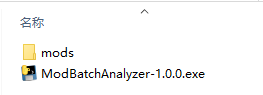
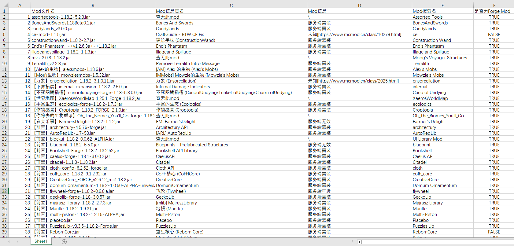

# Minecraft Mods 批量分析器

基于爬取 [MC百科](https://www.mcmod.cn/) 的 Mods 批量分析器，它可以分析你的 Mods 文件夹下的 Mod，给出每个 Mod 对应的百科页面的名称、Mod 是否为*服务端需装*、Mod 是否为 *Forge Mod* 等信息。这些信息将汇总成 Excel 表显示。

## 使用方法

1. [下载最新版本](https://github.com/APeng215/ModBatchAnalyzer/releases/latest)的 ***ModBatchAnalyzer-x.x.x.exe***
2. 将想要分析的 ***mods*** 文件夹（注意是**文件夹**）与 ***ModBatchAnalyzer-x.x.x.exe*** 放在同一目录下
3. 运行 ***ModBatchAnalyzer-x.x.x.exe*** 

## 画廊

